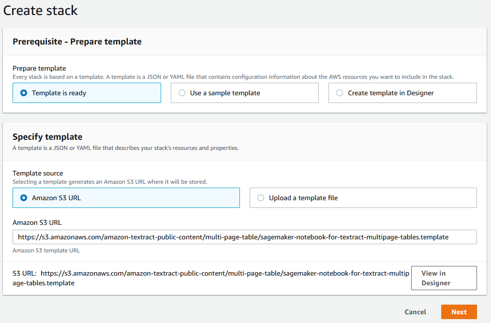
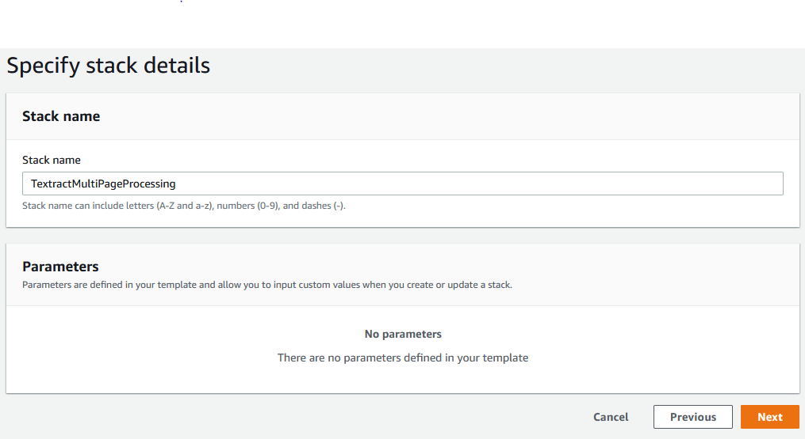

# Post Processing with Amazon Textract: Multi-Page Table Handling
[Amazon Textract](https://aws.amazon.com/textract/) is a fully managed machine learning (ML) service that automatically extracts printed text, handwriting, and other data from scanned documents that goes beyond simple optical character recognition (OCR) to identify, understand, and extract data from forms and tables.
 
Currently, thousands of customers are using Textract to process different types of documents. Many include tables across one or multiple pages, such as bank statements, financial reports, etc. Many developers expressed interest in a post-processing library linking or merging Textract responses where tables exist across multiple pages. In this blog post, we will demonstrate how you can use [amazon-textract-response-parser](https://pypi.org/project/textract-trp/) utility to accomplish this and highlight a few tricks to optimize the process. 

# Installation

1. Click on the launch stack button to launch a AWS CloudFormation template that deploys a SageMaker Notebook Instance along with this sample code repository. 

| AWS Region  |                                                                                                       Button                                                                                                        |
| :---------: | :-----------------------------------------------------------------------------------------------------------------------------------------------------------------------------------------------------------------: |
| _us-east-1_ |  |

2. Sign in to the [AWS Management Console](https://aws.amazon.com/console/) with your IAM user name and password. You will arrive at the 'Create Stack' page on the 'Specify Template' step. Click the next button.

3. On the Specify Stack Name step, set the Stack name as you prefer, and click on the Next button

4. Click the Next button in the Configure stack options step
5. In the review page, scroll down and acknowledge the IAM resource creation and click on the Create Stack button

# Accessing the Jupyter Notebook and Code Samples Review

1. After the stack creation finishes, go to the Outputs section, and click on the link corresponding to the value of the NotebookInstanceName Key
2. Click the Open Jupyter Button
3. Go to the home page of your Jupyter notebook and browse to the amazon-textract-multipage-tables-processing directory
4. Open the Jupyter notebook inside this directory to run the samples options mentioned in the Blog Post

# Cleaning up

1. After you finished your tests, just got to CloudFormation, select the name of the stack created in the installation section, and click on the Delete button.
2. Confirm the Stack deletion clicking on the Delete stack button
